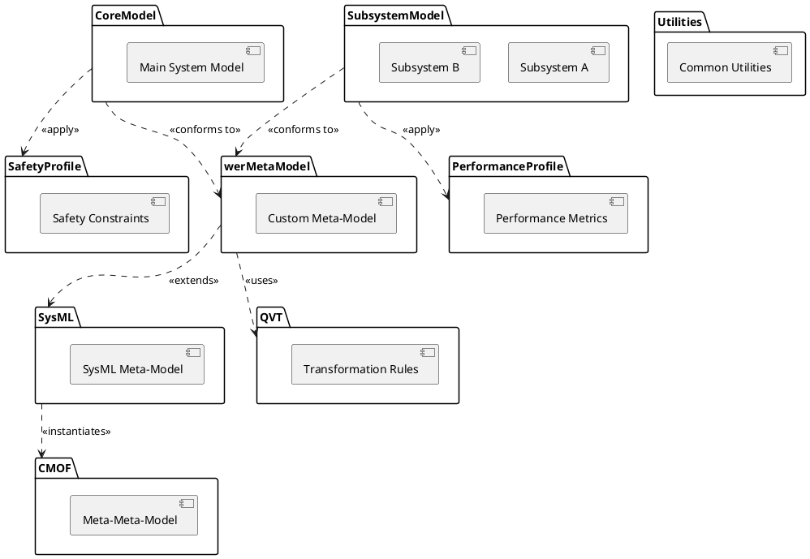

# Design

## Data Model Design

### Data Model with Mixins

Mixins are a great way to add reusable functionality to our classes without using inheritance hierarchies. Here's how we might structure our data models using mixins:

### Basic Element Model

First, define our basic `Element` class, which will be extended by various mixins.

```python
from pydantic import BaseModel, Field
from typing import List, Optional

class Element(BaseModel):
    id: str
    name: str
    description: Optional[str] = None

```

### Mixins

Next, define various mixins to add specific functionalities.

**TimestampMixin**: Adds created and updated timestamps.

```python
from datetime import datetime

class TimestampMixin(BaseModel):
    created_at: datetime = Field(default_factory=datetime.utcnow)
    updated_at: datetime = Field(default_factory=datetime.utcnow)

```

**RelationMixin**: Adds relationship management capabilities.

```python
class RelationMixin(BaseModel):
    related_elements: List[str] = Field(default_factory=list)

    def add_relation(self, element_id: str):
        self.related_elements.append(element_id)

    def remove_relation(self, element_id: str):
        self.related_elements.remove(element_id)

```

**ValidationMixin**: Adds OCL validation capabilities.

```python
class ValidationMixin(BaseModel):
    ocl_constraints: List[str] = Field(default_factory=list)

    def validate_constraints(self):
        # Implement OCL validation logic here
        pass

```

### Composite Element Model

Finally, create our composite `Element` model by combining the base `Element` with the mixins.

```python
class CompositeElement(Element, TimestampMixin, RelationMixin, ValidationMixin):
    pass

```

### Design Patterns and Behavioral Patterns

To realize the features of our app, consider the following design patterns and behavioral patterns:

1. **Factory Pattern**:
    - Use a factory pattern to create instances of our models. This is especially useful when dealing with complex initialization logic or when creating objects from various sources (e.g., XMI files).
2. **Repository Pattern**:
    - Implement a repository pattern for data access. This abstracts the database operations and allows we to switch between different storage mechanisms (e.g., MongoDB, Milvus) without affecting the business logic.
3. **Service Layer**:
    - Use a service layer to encapsulate business logic. Services can coordinate between repositories, apply validation, and handle business rules.
4. **Command Pattern**:
    - The command pattern is useful for implementing undoable operations, like changes to the model. This can be useful for features like backups and restoring state.
5. **Observer Pattern**:
    - Implement the observer pattern to handle events such as model changes or updates. This can be used for synchronization tasks or notifying parts of the system about changes.
6. **Strategy Pattern**:
    - Use the strategy pattern to encapsulate algorithms, such as different ways to validate or sync models. This allows we to switch between different strategies at runtime.

### Example: Using Repository Pattern

Here's an example of a repository pattern for managing elements:

```python
class ElementRepository:
    def __init__(self, db):
        self.db = db

    def get_element(self, element_id: str) -> CompositeElement:
        data = self.db.find_one({"id": element_id})
        return CompositeElement(**data)

    def save_element(self, element: CompositeElement):
        self.db.update_one({"id": element.id}, {"$set": element.dict()}, upsert=True)

    def delete_element(self, element_id: str):
        self.db.delete_one({"id": element_id})

```

### Example: Using Service Layer

Here's an example of a service layer for managing elements:

```python
class ElementService:
    def __init__(self, repository: ElementRepository):
        self.repository = repository

    def create_element(self, element_data: dict) -> CompositeElement:
        element = CompositeElement(**element_data)
        self.repository.save_element(element)
        return element

    def update_element(self, element_id: str, update_data: dict) -> CompositeElement:
        element = self.repository.get_element(element_id)
        for key, value in update_data.items():
            setattr(element, key, value)
        element.updated_at = datetime.utcnow()
        self.repository.save_element(element)
        return element

    def delete_element(self, element_id: str):
        self.repository.delete_element(element_id)

    def validate_element(self, element_id: str) -> bool:
        element = self.repository.get_element(element_id)
        return element.validate_constraints()

```

By using these patterns and mixins, we can create a modular and scalable architecture for our app. This approach makes it easier to maintain and extend the functionality of our application over time. Does this structure and approach align with our goals?


## CMOF

To extend wer PlantUML package diagram to include relationships to the CMOF (Common Meta-Object Facility) and illustrate the foundation for meta-meta-modeling and transformations like QVT (Query/View/Transformation), we can detail how wer MBSE model is anchored on these meta-modeling layers. This approach will help in explicitly showing the abstraction levels and the meta-layers that wer system modeling relies upon, which is crucial for defining transformation languages and ensuring that wer models are extensible and interoperable.



Explanation of the Extended Diagram

* CMOF Layer: Represents the foundational meta-meta-model that defines the structure and semantics of meta-models.
* SysML and Custom Meta-Model: These packages represent specific meta-models that conform to CMOF. wer custom meta-model might extend SysML or directly instantiate from CMOF.
* Model Level: These are the actual system models developed based on the defined meta-models.
* QVT: Positioned to interact with the meta-models, indicating its role in transforming models based on the defined transformation rules.
* This extended diagram effectively visualizes the hierarchical relationships from the foundational meta-meta-model (CMOF) through the transformation mechanisms (QVT), providing a clear architectural overview of how different modeling layers are structured and interact. This setup is particularly useful for complex systems engineering projects that require rigorous compliance with modeling standards and flexible transformation capabilities.
